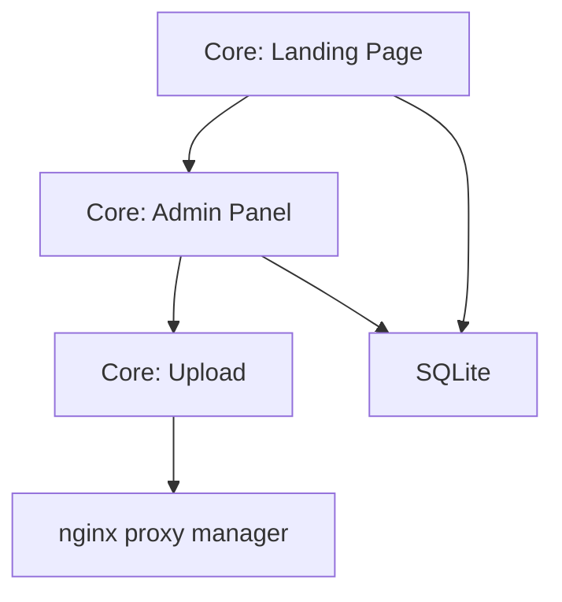

# AGENTS.md — Mapa de Enrutado para Agentes de IA

> Generado por SIXTEMA-SDD Pipeline
> Versión: 1.0.0
> Fecha: 2026-06-13

## Estructura del Proyecto

```
/
├── AGENTS.md                           ← Estás aquí
├── CONTEXT.md                          ← Glosario y contexto del proyecto
├── documentacion/
│   ├── especificaciones_estructurales/
│   │   └── core-estructural.md         ← Arquitectura técnica
│   └── especificaciones_funcionales/
│       └── core-funcional.md           ← Requisitos funcionales
```

## Módulos del Sistema

### Core (Portada Movilab)

**Propósito:** Landing page para movilab.es que muestra proyectos side-project con sistema de administración básico

**Especificaciones:**
- Estructural: `documentacion/especificaciones_estructurales/core-estructural.md`
- Funcional: `documentacion/especificaciones_funcionales/core-funcional.md`

**Contratos que NO DEBES romper:**
- GET / → Landing page con grid de proyectos
- POST /login → Cookie de sesión de 30 días
- POST /projects → Crear proyecto con imagen
- DELETE /projects/{id} → Eliminar proyecto y su imagen

**Dependencias:**
- SQLite → Almacena proyectos
- nginx proxy manager → Proxy inverso con SSL

---

## Guía de Navegación por Funcionalidad

### Si necesitas implementar: Landing Page (grid de proyectos)

1. **Lee primero:**
   - `documentacion/especificaciones_funcionales/core-funcional.md` → Caso de Uso CU-001
   - `documentacion/especificaciones_estructurales/core-estructural.md` → Endpoint GET /

2. **Contratos a respetar:**
   - GET / Debe retornar HTML con grid responsive (1→2→4 columnas)
   - Cada proyecto DEBE mostrar: captura, título, enlace web, enlace repo

3. **Invariantes del dominio:**
   - INV-001: Un proyecto NUNCA puede tener título vacío

4. **NO rompas:**
   - Los enlaces de proyectos DEBEN abrirse en nueva pestaña

---

### Si necesitas implementar: Admin Panel (CRUD)

1. **Lee primero:**
   - `documentacion/especificaciones_funcionales/core-funcional.md` → Casos de Uso CU-002, CU-003, CU-004, CU-005
   - `documentacion/especificaciones_estructurales/core-estructural.md` → Endpoints /admin, /projects

2. **Contratos a respetar:**
   - POST /login → Cookie persistente 30 días
   - POST /projects → multipart/form-data con imagen
   - DELETE /projects/{id} → Eliminar imagen del disco

3. **Invariantes del dominio:**
   - INV-001: Título requerido
   - INV-002: Solo PNG/JPG
   - INV-003: Máximo 5MB
   - INV-006: Eliminar imagen al borrar proyecto

4. **NO rompas:**
   - La cookie DEBE expirar en 30 días
   - Las credenciales DEBEN estar en .env

---

### Si necesitas implementar: Upload de imágenes

1. **Lee primero:**
   - `documentacion/especificaciones_funcionales/core-funcional.md` → Reglas RB-002, RB-003
   - `documentacion/especificaciones_estructurales/core-estructural.md` → Endpoint POST /projects

2. **Contratos a respetar:**
   - Solo PNG/JPG
   - Máximo 5MB
   - Validar en backend (no confiar en frontend)

3. **Invariantes del dominio:**
   - INV-002: Solo PNG/JPG
   - INV-003: Máximo 5MB

4. **NO rompas:**
   - El endpoint DELETE DEBE eliminar la imagen del disco

---

## Dependencias entre Módulos



**Orden de lectura recomendado:**
1. core-funcional.md (glosario y requisitos)
2. core-estructural.md (arquitectura y contratos)

---

## Contratos Críticos

Los siguientes contratos son compartidos entre funcionalidades. Cualquier cambio DEBE considerar el impacto:

| Contrato | Módulo Propietario | Consumidores | Notas |
|----------|-------------------|--------------|-------|
| GET / | Core | Landing, Admin | Retorna HTML con grid |
| POST /login | Core | Admin | Cookie 30 días |
| POST /projects | Core | Admin, Upload | multipart/form-data |
| DELETE /projects/{id} | Core | Admin | Elimina imagen del disco |

---

## Glosario Rápido

| Término | Definición Rápida | Spec Completa |
|---------|-------------------|---------------|
| Project | Side-project en la grid | core-funcional.md → Glosario |
| Grid | Visualización de 4 columnas | core-funcional.md → Glosario |
| Admin panel | Interfaz CRUD protegida | core-funcional.md → Glosario |
| Upload | Subir captura del proyecto | core-funcional.md → Glosario |

---

## Notas para Agentes de IA

- **Scope:** Esta es una aplicación pequeña. No hay módulos separados, todo está en Core.
- **Versionado:** Las specs usan SemVer. Si modificas un contrato, actualiza la versión.
- **Validación:** Antes de implementar, verifica que tu código cumpla con los invariantes declarados.
- **Preguntas:** Si algo no está claro, consulta la spec funcional antes de asumir.
- **Seguridad:** Las credenciales DEBEN estar en .env, nunca hardcodeadas.
- **Docker:** El contenedor DEBE estar en la red proxy_network para que nginx proxy manager funcione.
