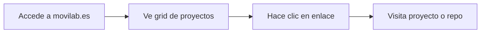
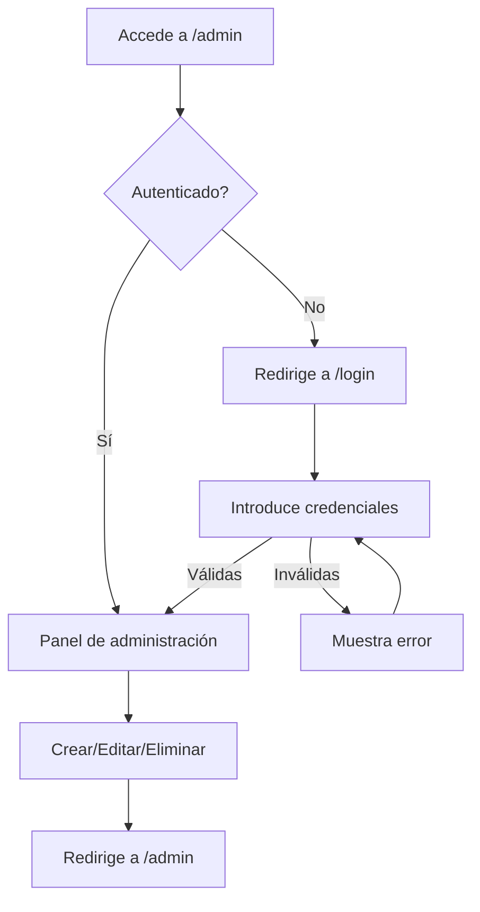

# Especificación Funcional: Core (Portada Movilab)

## 1. Propósito

Define QUÉ hace la aplicación y PARA QUIÉN: una landing page personal para movilab.es que muestra proyectos side-project de forma visual, con un panel de administración para gestionarlos.

## 2. Glosario de Dominio

| Término | Definición | Ejemplo |
|---------|------------|---------|
| **Project** | Un side-project que se muestra en la grid de la landing page | "Portada Movilab" es un project |
| **Grid** | Elemento visual de 4 columnas que muestra los proyectos en la página principal | La landing page muestra una grid |
| **Admin panel** | Interfaz web protegida por login para gestionar proyectos (CRUD) | /admin permite crear, editar, eliminar |
| **Project entry** | Un registro en la base de datos que representa un proyecto | Cada fila en la tabla projects |
| **Upload** | Acción de subir una captura de pantalla del proyecto a la app | Subir un PNG de 2MB |

> **Regla:** Cada término DEBE tener exactamente una definición. Si un término tiene múltiples significados, crear entradas separadas con contexto de uso.

## 3. Casos de Uso

### 3.1 Ver landing page
- **ID:** CU-001
- **Actor:** Cualquier visitante
- **Precondiciones:** Ninguna
- **Postcondiciones:** El visitante ve la grid de proyectos
- **Flujo Principal:**
  1. El visitante accede a movilab.es
  2. El sistema muestra la grid de proyectos con sus capturas, enlaces y repos
  3. El visitante puede hacer clic en los enlaces para visitar los proyectos
- **Flujos Alternativos:**
  - No hay proyectos: El sistema muestra un mensaje "No hay proyectos aún"
  - Error de BD: El sistema muestra una página de error amigable

### 3.2 Login al admin panel
- **ID:** CU-002
- **Actor:** Administrador (usuario único)
- **Precondiciones:** Ninguna
- **Postcondiciones:** El administrador está autenticado y puede gestionar proyectos
- **Flujo Principal:**
  1. El administrador accede a /admin
  2. El sistema redirige a /login
  3. El administrador introduce usuario y contraseña
  4. El sistema valida las credenciales
  5. El sistema crea una cookie persistente de 30 días
  6. El sistema redirige a /admin
- **Flujos Alternativos:**
  - Credenciales inválidas: El sistema muestra "Usuario o contraseña incorrectos"
  - Ya autenticado: El sistema redirige directamente a /admin

### 3.3 Crear proyecto
- **ID:** CU-003
- **Actor:** Administrador
- **Precondiciones:** Administrador autenticado
- **Postcondiciones:** Nuevo proyecto aparece en la grid
- **Flujo Principal:**
  1. El administrador accede a /admin
  2. El administrador rellena el formulario de nuevo proyecto
  3. El administrador sube una captura (PNG/JPG, máx 5MB)
  4. El administrador envía el formulario
  5. El sistema valida los campos requeridos
  6. El sistema valida la imagen (formato y tamaño)
  7. El sistema guarda la imagen en /data/uploads/
  8. El sistema crea el registro en la BD
  9. El sistema redirige a /admin
- **Flujos Alternativos:**
  - Campos requeridos faltantes: El sistema muestra error "Título es requerido"
  - Imagen inválida: El sistema muestra error "Formato no soportado" o "Imagen demasiado grande"
  - Error de BD: El sistema muestra error "Error al guardar"

### 3.4 Editar proyecto
- **ID:** CU-004
- **Actor:** Administrador
- **Precondiciones:** Administrador autenticado, proyecto existe
- **Postcondiciones:** Proyecto actualizado en la grid
- **Flujo Principal:**
  1. El administrador accede a /admin
  2. El administrador hace clic en "Editar" en un proyecto
  3. El sistema muestra el formulario con los datos actuales
  4. El administrador modifica los campos
  5. El administrador envía el formulario
  6. El sistema actualiza el registro en la BD
  7. El sistema redirige a /admin
- **Flujos Alternativos:**
  - Si se sube nueva imagen: La imagen anterior se reemplaza (se elimina del disco)
  - Proyecto no encontrado: El sistema muestra error 404

### 3.5 Eliminar proyecto
- **ID:** CU-005
- **Actor:** Administrador
- **Precondiciones:** Administrador autenticado, proyecto existe
- **Postcondiciones:** Proyecto eliminado de la grid
- **Flujo Principal:**
  1. El administrador accede a /admin
  2. El administrador hace clic en "Eliminar" en un proyecto
  3. El sistema muestra confirmación "¿Estás seguro?"
  4. El administrador confirma
  5. El sistema elimina el archivo de imagen (si existe)
  6. El sistema elimina el registro de la BD
  7. El sistema redirige a /admin
- **Flujos Alternativos:**
  - Cancelar: El sistema no elimina nada
  - Proyecto no encontrado: El sistema muestra error 404

## 4. Reglas de Negocio

### 4.1 RB-001: Título requerido
- **Descripción:** Todo proyecto DEBE tener un título
- **Invariante:** El campo `title` NUNCA puede estar vacío
- **Validación:** Backend verifica que title no está vacío antes de insertar
- **Ejemplo:** "Portada Movilab" es un título válido; "" no lo es

### 4.2 RB-002: Formatos de imagen
- **Descripción:** Solo se permiten archivos PNG y JPG
- **Invariante:** Cualquier archivo en uploads/ DEBE ser PNG o JPG
- **Validación:** Backend verifica extensión Y content-type del archivo
- **Ejemplo:** screenshot.png (válido), logo.svg (no válido)

### 4.3 RB-003: Tamaño máximo de imagen
- **Descripción:** Las imágenes DEBEN pesar 5MB o menos
- **Invariante:** Ningún archivo en uploads/ DEBE superar 5MB
- **Validación:** Backend verifica tamaño antes de guardar
- **Ejemplo:** imagen de 3MB (válida), imagen de 7MB (no válida)

### 4.4 RB-004: Credenciales en .env
- **Descripción:** Las credenciales del login DEBEN estar en variables de entorno
- **Invariante:** USER y PASSWORD NUNCA deben estar hardcodeados en el código
- **Validación:** Revisar que .env contiene las variables al iniciar
- **Ejemplo:** USER=admin, PASSWORD=secreto123

### 4.5 RB-005: Cookie de sesión
- **Descripción:** La sesión DEBE persistir 30 días
- **Invariante:** La cookie DEBE tener expiración de 30 días
- **Validación:** FastAPI configura expires=timedelta(days=30)
- **Ejemplo:** Al cerrar y abrir el navegador, la sesión persiste

### 4.6 RB-006: Eliminación en cascada
- **Descripción:** Al eliminar un proyecto, su imagen DEBE eliminarse del disco
- **Invariante:** No DEBEN quedar imágenes huérfanas en uploads/
- **Validación:** DELETE elimina archivo ANTES de eliminar registro
- **Ejemplo:** Si project.image_url = "abc123.png", se elimina data/uploads/abc123.png

## 5. Flujos de Usuario

### 5.1 Flujo de visitante (público)

- **Descripción:** El visitante navega la landing page y accede a los proyectos
- **Pasos detallados:**
  1. Accede a movilab.es
  2. Ve la grid de proyectos (1→2→4 columnas según dispositivo)
  3. Cada proyecto muestra: captura, título, enlace web, enlace repo
  4. Hace clic en cualquier enlace

### 5.2 Flujo de administración

- **Descripción:** El administrador gestiona los proyectos
- **Pasos detallados:**
  1. Accede a /admin
  2. Si no está autenticado, redirige a /login
  3. Introduce credenciales
  4. Si son válidas, crea cookie de 30 días
  5. Accede al panel de administración
  6. Puede crear, editar o eliminar proyectos

## 6. Invariantes del Dominio

| ID | Invariante | Verificación |
|----|------------|--------------|
| INV-001 | Un proyecto NUNCA puede tener título vacío | Validación en BD y backend |
| INV-002 | Una imagen en uploads/ DEBE ser PNG o JPG | Validación al subir |
| INV-003 | Una imagen NUNCA puede superar 5MB | Validación al subir |
| INV-004 | La sesión del admin DEBE expirar en 30 días | Configuración de cookie |
| INV-005 | Eliminar un proyecto DEBE eliminar su imagen | Lógica en DELETE endpoint |

## 7. Restricciones de Negocio

### 7.1 Acceso
- Solo UN usuario puede autenticarse (admin panel)
- No hay roles ni permisos granulares

### 7.2 Contenido
- Máximo un proyecto puede tener: título, descripción, url, repo_url, imagen
- La descripción es opcional
- Los enlaces son opcionales

### 7.3 Almacenamiento
- Las imágenes se guardan en disco dentro del contenedor
- El backup es manual (copiar /data/)
- No hay límite de proyectos (solo espacio en disco)

## 8. Métricas de Éxito

- Tiempo de carga de la landing: < 2 segundos
- Disponibilidad: > 99% (best-effort)
- Satisfacción del usuario: La grid se ve bien en móvil, tablet y desktop

## 9. No Funcional (desde perspectiva de usuario)

- **Tiempo de respuesta:** < 2 segundos para cargar la landing
- **Disponibilidad:** > 99%
- **Usabilidad:**
  - La grid DEBE ser responsive (1→2→4 columnas)
  - Los enlaces DEBEN abrirse en nueva pestaña
  - El admin DEBE funcionar sin JavaScript
  - Las imágenes DEBEN redimensionarse correctamente en la grid

## 10. Changelog

| Versión | Fecha | Cambios |
|---------|-------|---------|
| 1.0.0 | 2026-06-13 | Versión inicial |
